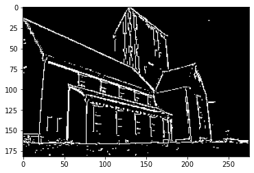

# Edge-Corner-Detection

`Canny Edge Detection`

Take as an input an image, the sigma of the Gaussian filter and the two low and high thresholds. The output is a binary image. Implement gaussian convolution as a separable sequence of horizontal and vertical convolutions.

`Harris Corner Detection`

Take as an input window_size, k, threshold and an image.

----

Example:

original image:

output:

